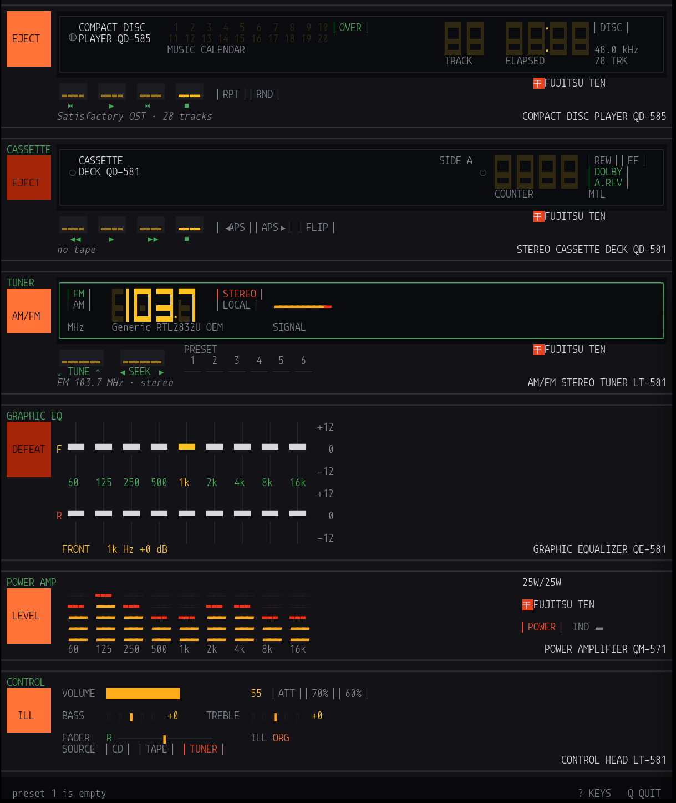

# ten-qd

A terminal music player wearing an 80s car stereo.



It plays FLAC, MP3, AAC, Vorbis and WAV; it compiles folders into two-sided
tapes; and it receives broadcast FM off an RTL-SDR. The equaliser is eighteen
real biquads, the meters are a real FFT of the real output, and the STEREO lamp
lights off a real 19 kHz pilot.

**It is not a faithful reproduction of a Fujitsu Ten stack**, and stopped
trying to be fairly early on. The advertisement that started it is the design
language — the colours, the glyph vocabulary, the way a lit segment reads
against an unlit one — not a specification ([see the ad](docs/the-ad.md)). Where authenticity and a good
instrument disagreed, the instrument won: the amp meters run vertically so they
line up with the equaliser bands, and the QD-585 CD player is a unit Fujitsu
Ten never built.

What survived from the original design brief is the part worth keeping: **every
lit thing on the panel is connected to something real.** No decorative meters,
no indicator that is always on.

## Why a terminal

The first pass was an HTML page, and it worked. But shipping that as an
application means Electron or Tauri — a browser engine, a build pipeline and a
few hundred megabytes of runtime, to draw some lit rectangles.

A character grid is the period-correct medium. Something built between the mid
80s and the mid 90s would have had a fixed grid of cells, each either lit or
not, and a small palette — which is *exactly* what a vacuum-fluorescent display
is. So the constraint turns out to be generative rather than limiting:
seven-segment digits assembled from quadrant blocks read more like a real VFD
than a photorealistic render does, because they are made the same way. The
[ghost segments](docs/design.md#the-ghost) are only convincing because the
medium genuinely cannot do anything smoother.

The practical version of the same argument: this is one 5.9 MB binary that
starts instantly, uses no GPU, and works over SSH.

## Building it

Three system libraries beyond Rust itself — ALSA (cpal's Linux backend),
librtlsdr (the tuner), and pkg-config to find them. `make deps` checks all of
it and prints the install line for your package manager if anything is missing:

```sh
make deps        # check build and runtime dependencies
make run         # build optimised and start the panel
make install     # copy to ~/.local/bin (XDG user scope)
make help        # every target
```

`make install` puts the binary in `$XDG_DATA_HOME/bin`, defaulting to
`~/.local/bin`, and tells you if that is not on your `PATH`. `make uninstall`
removes it and leaves your settings alone; `make forget` clears those too.
Override the location with `make install PREFIX=/usr/local`.

Rust 1.85 or newer (edition 2024). `make check` runs clippy with warnings as
errors, plus the tests.

## Running it

```sh
make run                                # first album found under ~/Music
cargo run --release -- /path/to/album   # a folder of audio files is a disc
make screenshot                         # render one frame to stdout and exit
make radio-check                        # sweep the FM band and report signal
```

Wants a terminal at least **84 columns** wide and 24-bit colour, with a font
that has good block-element coverage — any Nerd Font will do. The rack is 70
rows tall and scrolls with PgUp/PgDn or the wheel.

**Every control is clickable.** Sliders take a click anywhere along their
travel, the volume bar takes a click at the level you want, and the music
calendar cues a track. Press `?` in the app for the full key map.

| | |
|---|---|
| `c` `t` `u` | source: compact disc · cassette · tuner |
| `o` | open the disc/tape browser |
| `SPACE` `s` | play/pause · stop (acts on the selected source) |
| `←` `→` / `p` `n` | previous · next  (tuner: seek) |
| `1`–`9` | cue a track  (tuner: recall preset) |
| `!` … `^` | store the current station as a preset (kept between runs) |
| `[` `]` `g` | tune down/up · LOCAL |
| `e` `r` `z` | eject · repeat · random |
| `v` `y` `a` | flip the tape · Dolby · auto-reverse |
| `↑` `↓` `m` | volume · attenuator |
| `,` `.` / `<` `>` | bass · treble |
| `;` `'` | fader rear/front |
| `h` `l` / `j` `k` | select equaliser band · cut/boost |
| `f` `d` `0` | front/rear bank · defeat · flat |
| `i` `w` | illumination colour · amp power |

### The radio

Needs an RTL-SDR, and needs the DVB-T kernel driver out of the way — it claims
the device on sight. `make deps` will tell you if it has:

```sh
sudo modprobe -r dvb_usb_rtl28xxu dvb_usb_v2 rtl2832
rtl_test -t                                  # should name the tuner chip
```

Without one the panel says so and the other two sources are unaffected. See
[docs/tuner.md](docs/tuner.md) for how the demodulator works and what had to be
measured to make the meters honest.

## Documentation

| | |
|---|---|
| [docs/sources.md](docs/sources.md) | the three sources — what a disc, a tape and a station each are |
| [docs/audio.md](docs/audio.md) | the signal path, the DSP, and the clock the display runs on |
| [docs/tuner.md](docs/tuner.md) | FM demodulation on an RTL-SDR, and calibrating it against the band |
| [docs/design.md](docs/design.md) | the panel language: glyphs, colour, and what is invented |
| [docs/memory.md](docs/memory.md) | the 12-volt memory: what persists, where, and how it heals |
| [docs/the-ad.md](docs/the-ad.md) | the 1986 advertisement this came from, and what was taken from it |
| [docs/panel-reference.html](docs/panel-reference.html) | the original HTML prototype this was ported from |

## Layout

| | |
|---|---|
| `ui/theme.rs` | tokens. Every colour in the build, and nothing else. |
| `ui/glyph.rs` | the character vocabulary — seven-segment, meters, furniture. |
| `ui/chassis.rs` | bays, windows, lamps, keys. Knows nothing about CD players. |
| `ui/units/*` | one module per component. No unit reaches into another. |
| `ui/hit.rs` | click targets, registered by the units as they draw. |
| `ui/overlay.rs` | the key map and the browser panel. |
| `audio/mod.rs` | decode thread, output callback, the clock. |
| `audio/dsp.rs` | biquads and the parameter snapshot. |
| `audio/analysis.rs` | the 9-band analyser, on its own thread. |
| `audio/radio.rs` | the FM demodulator and the SDR threads. |
| `disc.rs` | a folder is a disc; its file order is the TOC. |
| `browser.rs` | the shelf — what to put in the machine, and how. |
| `state.rs` | unit state, and the one function allowed to mutate it. |
| `memory.rs` | the 12-volt memory — what survives the ignition going off. |

## Known limits

- **No AM.** The R820T front end starts around 24 MHz, so the AM broadcast band
  is out of reach without a direct-sampling modification. The band key says so
  rather than tuning nothing.
- **Front and rear sum to stereo.** A four-channel device would let the two
  equaliser banks drive four speakers; here the fader crossfades between the
  two curves. Audible and honest about itself, but not the same thing.
- **Resampling is 4-point Hermite**, and it is in the path constantly (48 kHz
  device, 44.1 kHz discs). `rubato` is the drop-in upgrade; `hermite()` in
  `audio/mod.rs` is the only function that would change.
