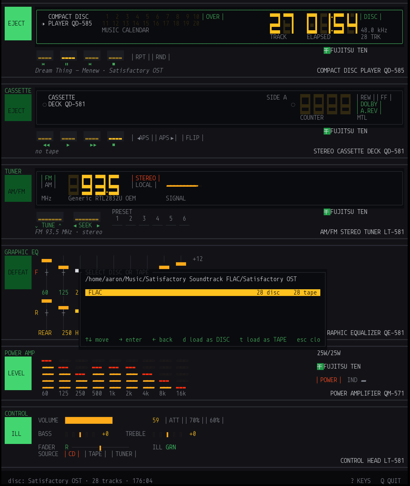

# The panel language

The [1986 Fujitsu Ten advertisement](the-ad.md) is the design language, not a
specification. It supplies the colours, the glyph vocabulary, the proportions
of a bay, and the way a lit segment reads against an unlit one. It does not
supply a parts list, and this build stopped treating it as one fairly early.

## Three layers

The rule carried over from the HTML prototype: **retheme from the top layer
alone; no unit reaches into another unit.**

| | |
|---|---|
| `ui/theme.rs` | tokens. Every colour in the build, and nothing else below it knows a hex value. |
| `ui/glyph.rs` | the character vocabulary. Switching the whole stack to a different glyph set is a one-file edit. |
| `ui/chassis.rs` | bays, windows, lamps, keys, meters. Knows nothing about CD players. |
| `ui/units/*` | one module per component. Draws inside the `Rect` it is handed, reads only its own slice of state. |

The terminal has no alpha channel, so every `rgba(x, .08)` in the original CSS
became an explicit blend against the surface it sat on. `theme::mix` does that
once, at the token layer.

## Seven-segment

A digit is 3 cells wide by 3 cells tall, built from quadrant blocks:

```
char row 0:   a = UL+UR of all three cells   (top bar)
              f = UL+LL of the left cell     (upper-left stroke)
              b = UR+LR of the right cell    (upper-right stroke)
char row 1:   g = LL+LR of all three         (middle bar, sits mid-height)
char row 2:   d = LL+LR of all three         (bottom bar)
              e = UL+LL of the left cell     (lower-left stroke)
              c = UR+LR of the right cell    (lower-right stroke)
```

The unions fall out as `▛ ▜ ▙ ▟` at the corners, which is why the digits look
mitred rather than like stacked dashes:

```
▛▀▜   ▌ ▐   ▀▀▜   ▛▀▜
▌ ▐   ▙▄▟   ▄▄▟   ▙▄▟
▙▄▟     ▐   ▙▄▄   ▙▄▟
 0      4     2     8
```

Colons and decimal points are one cell wide, not three — they are separators,
not digits, and they hug their neighbours so `04:38` groups the way it does on
the real display.

## The ghost

Every numeral is drawn **twice**: once as a full `8` in the un-driven segment
colour, then the live value over it. Only the lit cells of the live pass are
written, so the ghost shows through the gaps.

This is the single detail that does the most work. A display whose dark
segments you cannot see does not read as a display — it reads as floating
numbers. The ghost is why the CD player's `TRACK` field looks like glass with
something behind it rather than like text.

It also means an unused digit position stays visible: the tuner's hundreds
digit is a lit ghost `8` below 100 MHz, exactly as it is on a real dial, and
the field does not shift when it lights.

## Ink, phosphor and bulbs

Three kinds of colour that behave differently, and keeping them separate is
what stops the panel looking uniformly backlit:

| | |
|---|---|
| **ink** | screen-printed legends on the chassis. Green. Does not change. |
| **phosphor** | the VFD and the LEDs. Amber and red. Does not change. |
| **bulbs** | the illuminated buttons down the left spine. |

The **ILL** key swaps the lamp colour of every illuminated button and nothing
else, because that is what it did in the car — it changed bulbs, not ink. This
is also the one control that has no effect on the audio and was kept anyway.



Compare the two: the spine lamps go from orange to green, and *nothing else
moves*. The printed legends stay green because they are ink, and the VFD
numerals stay amber because that is the phosphor. Had ILL been implemented as a
global hue rotation — the obvious shortcut — the whole panel would have shifted
and the illusion of three separate materials would have collapsed.

Key caps are dark with a lit slot, and the legend is printed on the **panel
beneath** the cap, not on the cap. Drawing them as one object was wrong and
looked it.

## Where faithfulness lost

Four deliberate departures, each because the instrument was better for it:

**The amp meters run vertically.** In the ad they are a horizontal row of amber
dots. Here they are nine columns sitting directly below the nine equaliser
columns, on the same grid, bound to the same centre frequencies. Pull a slider
and watch its meter drop. That turns a stack of separate panels into one
instrument, and it is the reason the meters are worth having at all.

**The QD-585 does not exist.** Fujitsu Ten never built a CD player for this
stack. It is drawn in the grammar of the units that surround it, which is the
only thing that makes a counterfactual component convincing.

**The QD-581 is a playlist transport.** A cassette deck with no cassette in it.
What it kept is the *display* — see [sources.md](sources.md).

**The F / R bank markers are single glyphs**, not boxed as in the photograph.
The box cost three columns, and spending them there pushed the whole equaliser
up against the DEFEAT lamp with no gap. Every bay now has the same one-column
clearance between its spine lamp and its contents.

## Geometry

The rack is drawn into an off-screen buffer at its natural full height and then
blitted through the viewport, so a short terminal **scrolls** rather than
squashing the panels. A 1985 component stack does not reflow.

Bay heights are fixed constants in `ui/mod.rs`. The panels have the proportions
they have.

## Clicking

Units register the rectangle each control occupies **while they draw**, into a
`HitMap` that is cleared every frame. There is no second layout description to
drift out of sync with the first — a control is clickable for the same reason
it is visible, and at exactly the coordinates it was drawn at.

Zones are recorded in rack coordinates and translated into viewport coordinates
once, after the rack is drawn. Later registrations win, so a key cap drawn over
its bay receives the click.

This is why a slider takes a click anywhere along its travel: each of its five
rows registers its own zone carrying the gain that row represents.

## The contract

```
Command  — a control was operated.  UI ──▶ engine.  Never mutates state.
Patch    — the engine reports truth. engine ──▶ UI.  The only mutator.
```

Press a key and nothing on the panel moves until the engine says so. A PLAY on
a file that will not open leaves the transport reading STOP, which is what the
real unit would do. The display is a readout, not a wish.
