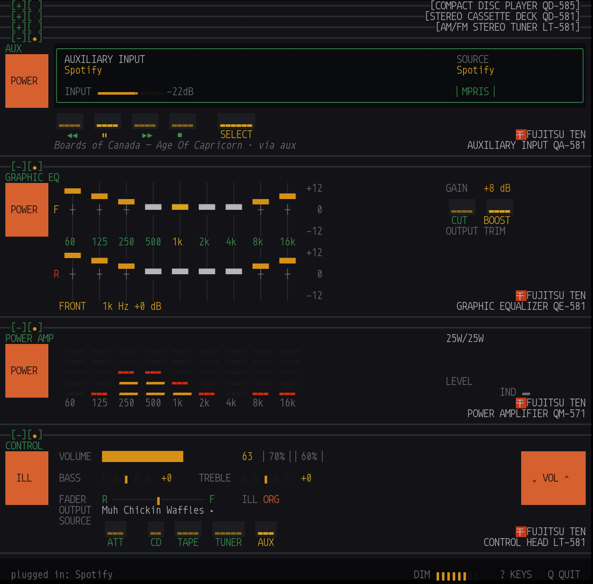
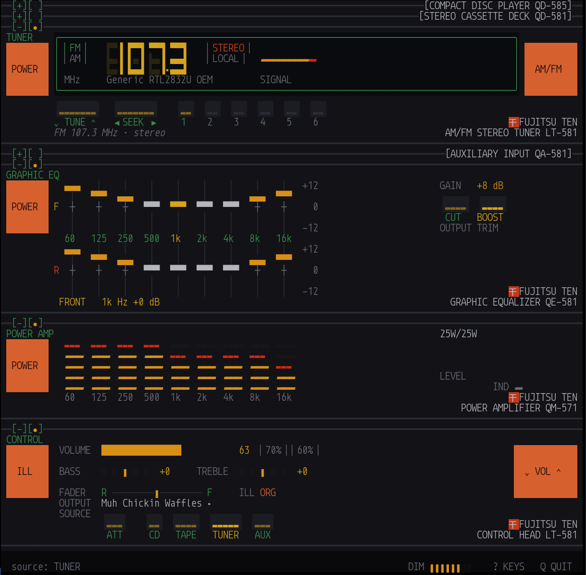

# The three sources

One source at a time — this is a head unit, not a mixer. Everything downstream
of the source is identical no matter where the audio came from, because the
decoder thread is the only producer on the output ring. For the tuner its job
is simply to pump the radio's ring into the output ring.

## A disc is a folder

`disc::load` opens **every** file in the folder before reporting a disc. That
is deliberate and it is why loading a large album takes a moment: the display
cannot honestly show a track count or a total time it has not verified. A real
player reads the lead-in before it plays a note.

Ordering follows the disc's own table of contents — if every file carries a
track number, that wins; otherwise filename order stands. A file that will not
open is skipped rather than aborting the load, because one bad track should not
eject the whole disc.

The display shows a track number, an elapsed time, and a music calendar. That
is all a 1985 player had, and the discipline is the point. Track titles live on
the shelf strip *below* the panel, off the face entirely.

The **music calendar** is the grid of track numbers: printed if the disc has
that track, lit while it is playing. Twenty cells and an OVER lamp, which is
how real players handled discs with more tracks than the calendar had room for.
Clicking a cell cues that track.

## A tape is a playlist

And its two sides are the two halves of that playlist.

`Tape::from_tracks` splits where the **cumulative running time** crosses the
midpoint — not at the midpoint of the track count. A cassette holds a fixed
running time per side, so a long opener goes on side A alone:

```rust
// 10:00, 1:00, 1:00, 1:00  ->  side A: 1 track, side B: 3 tracks
```

That is the same arithmetic anyone compiling a tape by hand used to do.

### Why the deck earns a bay next to the CD player

Because of what it *cannot* show. A cassette has no index, so the QD-581
displays a **linear four-digit counter** that resets when you turn the tape
over — not a track number, not a track time. Everything the CD player states
precisely, the deck can only approximate.

Two units, one file decoder, completely different character. That difference is
the reason both exist.

- **Auto-reverse** flips at the end of side A. Coming back to side A only
  happens on repeat; otherwise the deck stops at the end of side B, as it would.
- **APS** — Automatic Program Search — is the deck's name for track skip. Below
  three seconds into a track it steps back; past that it restarts the current
  one, the same rule the CD player follows.
- **REW / FF** wind by ten seconds a press, seeking within the track. A deck has
  no index to jump to, so this scrubs rather than skipping.
- **FLIP** turns the cassette over and restarts the counter.

## AUX is a wire

A fourth source, beside CD, TAPE and TUNER. `a` selects it; `A` opens a picker
listing what is currently playing on the machine.

Underneath it is a PipeWire null sink named **ten-qd aux input** — the same
trick EasyEffects uses for its virtual sink — captured into the same DSP chain
a disc uses. From the equaliser onward there is no difference between Spotify
and a FLAC on disk.

- **Plugging in.** Choosing from the picker moves that stream onto the aux
  sink, remembering where it came from. Nothing moves unless you ask; you can
  also select **ten-qd aux input** in the player's own output menu, or in the
  desktop's sound settings, and never open the picker at all.
- **Transport.** The bay's keys drive the plugged-in player over MPRIS, which
  every likely source already speaks — the Spotify client, Chromium (so
  YouTube Music, Apple Music, Pandora in a tab), Firefox, mpv. This is the one
  place the build improves on the object it imitates: a real auxiliary input
  was a one-way cable.
- **INPUT** reads the peak level on the cable, before the equaliser and
  whichever source the rack is set to — so a bad cable is visible even while a
  disc is playing. Twelve segments over −48 to 0 dBFS, and ` --dB` for true
  silence, because nothing and very-quiet are different answers. See the second
  gotcha below for why this exists.



The three units above it are folded to their bars, which is the arrangement
this ends up in: the aux input open and reading, everything not in use out of
the way. See [design.md](design.md) for the folding.

### It was a cassette adapter first

The cable used to be modelled as the tape-shaped shell with a headphone lead —
the thing you plugged into a Discman and pushed into the deck, so the mechanism
would spin and believe it was playing.

That is a wonderful object and it was the wrong interface. A deck carrying an
adapter has a counter counting nothing, two sides that do not exist, a pair of
reels turning against a loop of tape that is not the music, FLIP and APS and
auto-reverse all meaningless, and Dolby applied to a signal that never touched
a tape head. Every readout on the unit made false at once, in order to model a
cable — while the cable's *own* facts, what is plugged in and how hard it is
driving, had nowhere to go.

A cable is a source. Making it one gave the deck back its meaning and gave the
cable a bay of its own, with the meter and the transport it always wanted.

Two things this got wrong on the way, both worth knowing:

**Never offer your own output stream.** Plugging the rack's output back into
its own input is a feedback loop, and it is the one stream in the list that can
make one. PipeWire does not populate `application.process.id` for sink-inputs,
so a PID test matches nothing and silently lets the loop close — it has to be
matched on `node.name` / `application.name`, both of which carry the executable
name. Matching only the running executable is still not enough: under
`cargo test` the binary is `ten_qd-<hash>`, so the fixed package name is
checked too.

**`<sink>.monitor` is a PulseAudio name, and `pw-record` will not tell you it
missed.** `pactl` lists `ten_qd_aux.monitor` as a source, so it looks like
the obvious thing to record from. In the PipeWire graph it is not a node at
all — a monitor is a set of *ports* on the sink node — and `--target` resolves
PipeWire node names. The name matches nothing, and rather than failing,
`pw-record` falls back to the **default source**, which on a desktop is a
microphone.

The failure is silent in every direction that matters. Capture runs, the ring
fills, the panel lights up, and the cable carries the room. It reads about
−45 dBFS — a plausible-looking number that invites you to go hunting for a gain
fault, and every volume in the chain measures unity because every volume in the
chain *is* unity. The tell, once you think to look for it, is that the meter
moves when you speak.

The fix is to target the sink and ask for its monitor explicitly:

```
pw-record --target=ten_qd_aux -P '{ stream.capture.sink = true ... }'
```

**So the bay has an input meter.** This cost two sessions of measuring dBFS
with external tools, on a rack whose whole premise is that every lit thing on
the panel is connected to something real. That premise has to extend to
*failure*: the aux bay shows the peak level arriving on the cable, read
before the ring and before the equaliser, and reported whether or not AUX is
the selected source. A cable carrying the wrong
thing now says so on the panel. `ten-qd --aux-check` prints the same
number, separately from the band meters, so the two questions — *is anything on
the cable* and *did it survive the rack* — can never again be confused for one.

## Where the sound goes

The rack holds its own opinion about its output device, the way a meeting
application does, rather than following the system default. `O` opens the
picker. This is not a preference: set the desktop's output to *ten-qd aux input*
while the rack followed the default and it would be driving its own
input.



The choice is kept in the 12-volt memory, and our own sink is never
offered — see the feedback-loop note above.

## A station is a station

The tuner has its own POWER switch, separate from the amplifier's and from
being the selected source. Off means the display goes dark — all ghost
segments, no reading — and the front end stops. A radio that is off, rather
than one that is merely not being listened to.

See [tuner.md](tuner.md).

## The browser

`o` opens a shelf, not a file manager. The only question being asked is *what
do I put in the machine*, and there are two ways to answer it:

| | |
|---|---|
| **`d` — load as disc** | the folder's own audio files, in TOC order. Flat, because a disc is one physical object. |
| **`t` — load as tape** | everything below the folder, recursively, compiled into a playlist and split into two sides. |

Each row shows both counts, so the distinction is visible before you commit:


That folder holds 28 files directly, so it works either way: as a disc it is a
28-track TOC, as a tape the same 28 tracks split across two sides. The counts
differ when a folder only *contains* music rather than holding it —

```
  Satisfactory Soundtrack FLAC                  0 disc    48 tape
```

— where loading as a disc would give you an empty tray, and as a tape a
48-track compilation across two sides. Real libraries nest, so the browser walks up to
five levels rather than checking one.

## Switching sources

Selecting a source stops whatever the others were doing, the way a
single-transport head unit has to. Each source remembers its own position, so
switching away and back returns you to where you were.

The shared transport keys — `SPACE`, `s`, `←`, `→` — act on whichever source is
selected. The digit keys are context-sensitive: track cue on the disc and the
tape, preset recall on the tuner.
