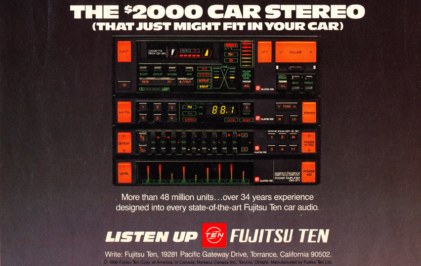

# The advertisement

> ## THE $2000 CAR STEREO
> ### (THAT JUST MIGHT FIT IN YOUR CAR)
>
> More than 48 million units… over 34 years experience designed into every
> state-of-the-art Fujitsu Ten car audio.
>
> **LISTEN UP · FUJITSU TEN**
>
> Write: Fujitsu Ten, 19281 Pacific Gateway Drive, Torrance, California 90502.
>
> © 1986 Fujitsu Ten Corp. of America. In Canada: Noresco Canada Inc.,
> Toronto, Ontario. Manufactured by Fujitsu Ten Ltd.

Two thousand dollars in 1986 is somewhere north of five and a half thousand
today. The joke in the subhead is doing real work: this is four separate DIN
components stacked into a dashboard, sold to people who owned a car and thought
of it as a listening room.

## What the ad actually shows

Four units, top to bottom:

| | |
|---|---|
| **QD-581** | cassette deck, with the control head to its right |
| *(unnamed)* | AM/FM tuner, reading 88.1 |
| **QE-581** | graphic equaliser |
| **QM-571** | 25W/25W power amplifier |

The second scan settled two model numbers the first one was too soft to
resolve — the equaliser is **QE-581** and the amplifier **QM-571**, which is
what the panels in this build now carry.

Legends readable on the deck and control head, most of which survived into the
TUI: `B-SKIP` `REPEAT` `M SCAN` `APS` `REW` `FF` `⇑/PRO` `ATT` `VOLUME` `ILL`
`BASS` `TREBLE` `DOLBY NR` `LOCAL` `MEMO` `STEREO` `DEFEAT` `FADER F/R` `LEVEL`
`POWER IND`, plus the tone display drawn as a lit **X** between BASS and TREBLE.

## What this build took from it

The **design language**, not the parts list:

- The three-material discipline — screen-printed green ink, amber VFD phosphor,
  and orange illuminated bulbs — which is the thing that makes the panel read
  as an object rather than as coloured text. See
  [design.md](design.md#ink-phosphor-and-bulbs).
- The bay proportions: a wide black display window, a spine of illuminated
  buttons down the left, model number and badge at the right.
- Key caps as dark blocks with a lit slot, with the legend printed on the panel
  *beneath* the cap rather than on it.
- The equaliser being **two banks of nine** — an upper row of caps and a lower
  row with the frequency legend printed between them, `F` beside one and `R`
  beside the other. That detail is why this build has two independently curved
  filter banks and a fader that crossfades between them, rather than one
  nine-band EQ.
- The amplifier's meters being amber dots with a red bar riding the peak, not a
  green-to-red ramp.

## What it deliberately did not take

- **The horizontal meters.** In the ad the QM-571's meters run left to right.
  Here they run vertically, on the same column grid as the equaliser bands, so
  pulling a slider visibly drops its meter.
- **A CD player.** There isn't one in the ad because Fujitsu Ten didn't build
  one for this stack. The QD-585 is invented, drawn in the grammar of its
  neighbours.
- **A real cassette.** The QD-581 here is a playlist transport that kept the
  deck's *display* — a linear counter, no track index.
- **AM.** The ad's tuner has it; an RTL-SDR cannot reach the AM broadcast band
  without a hardware modification.

The full reasoning for each departure is in
[design.md](design.md#where-faithfulness-lost).

## Provenance

The scan is reproduced here as design reference for a non-commercial project,
and as the source this build is transparently derived from. Fujitsu Ten and the
advertisement's copy and artwork belong to their respective owners; nothing in
this repository is affiliated with or endorsed by them.

The [HTML panel study](panel-reference.html) that preceded the Rust build was
reconciled against this image component by component, and its comments record
the corrections that came out of that — the two-bank equaliser, the deck's two
display windows, the tuner's single TUNE rocker.
